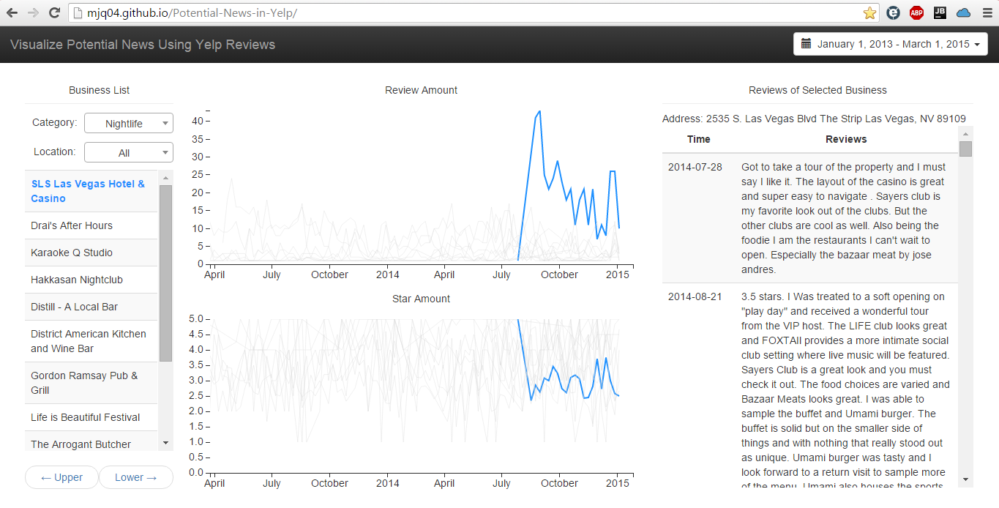

# Visualize Potential News Using Yelp Reviews
This is a visual analytic platform to mine and visualize the data of yelp reviews to help investigative journalists explore large sets of crowd-sourced reviews by D3.js.
# Authors:
Shauro, ly921@nyu.edu

mjq04,  jm6413@nyu.edu
# Application Images:

# Application Description:
Journalists want to explore crowd-sourced reviews from Yelp to identify hot spots. However, large human-generated text data is complex to analyze and it is hard for journalists to look into millions of Yelp reviews. Therefore, developing a visual analytic platform to mine and visualize these data could help investigative journalists explore large sets of crowd-sourced reviews.
This visualization project can help journalist to get two information:

1.	Where are potential news in Yelp logs? 
    The tool recommends business list based on abnormality possibility, and provide related business review_amount and average stars trend. Both of them can help users to look up potential news.
2.	What are these potential news?
    The tool provides review details and recommend some highlighted words in reviews that maybe helpful for understanding the background of the abnormality found in step one.

# How to Configure Server
1. Download and install elasticsearch 2.0.0 accroding to the website as below:

    https://www.elastic.co/downloads/past-releases/elasticsearch-2-0-0

2. Modify ./config/elasticsearch.yml file as the one we shared in the "configrationInfo" folder.

3. Download yelp dataset from the website as below. The program needs:"yelp_academic_dataset_business.json" and "yelp_academic_dataset_review.json".

    https://www.yelp.com/dataset_challenge/dataset

4. Install Python 3.4.3

5. Put the two json files in "dataPreparation" folder. Run "write_business_and_review_files_for_es_week.py" and "write_review_files_for_es.py". We will get three batch of files:

    1) business0.json ~ business6.json

    2) review0.json ~ review15.json

    3) category.txt

    Both json files fit elasticsearch format requirement. (The files are splited into several pieces due to laptop computing amd memory resource limitation.)
6. Start elasticsearch server, and run "bulk_create.html" in "dataPreparation" folder to load all generated files and bulk create documents in ElasticSearch. If yelp provide more data, "business_files_amount" and "review_files_amount" parameter may need modification according to the actual number of files generated. You may have to load the files part by part, because uploading all of them in one batch requests much computing and memory resource.

7. Keep "category.txt" files in "dataPreparation" folder, which will be called by front-end program.

# Related Links:
Link to the Video:https://vimeo.com/149686492

Link to the Demo:http://mjq04.github.io/Potential-News-in-Yelp/

Link to the Final Report:https://docs.google.com/document/d/1dnX4LjAm40v2nLBm2bWV9WUH-JQNcY0ZRZHnIZ4CNic/edit?usp=sharing

Link to the data:https://www.yelp.com/dataset_challenge/dataset

